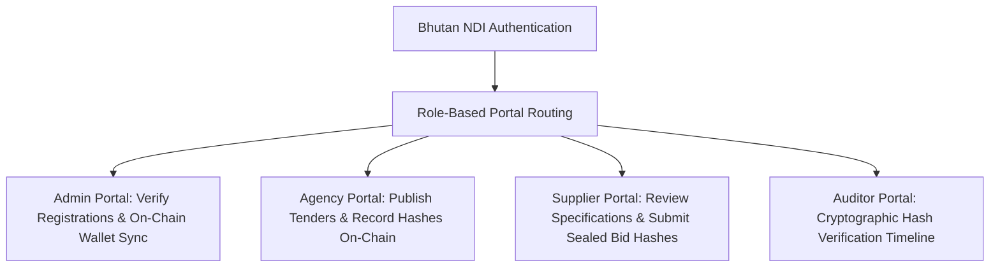

# 🇧🇹 BGPS — Blockchain-Based Government Procurement System

> A secure, transparent, and immutable full-stack e-procurement platform designed for the Kingdom of Bhutan, integrating **Bhutan National Digital Identity (NDI)** for authentication and **Ethereum Sepolia Smart Contracts** for on-chain integrity verification.

---

### 🌟 Project Presentation & Demo

To facilitate evaluation by judges and auditors, all core presentation resources are highlighted below:

* **🎥 YouTube Walkthrough & Video Demo:** [Watch the BGPS Video Demonstration](https://youtu.be/Uw1MsazKbGw)
* **📊 Project Pitch Deck / Slides:** [View the BGPS PowerPoint Presentation](https://docs.google.com/presentation/d/1Ux-aiaBf3EE-cvT3RXvUsl7ShDPNMD8w/edit?usp=sharing&ouid=117524635319457449897&rtpof=true&sd=true)

---

## 🏛️ Core System Overview

The **Blockchain-Based Government Procurement System (BGPS)** modernizes public procurement by introducing cryptographic accountability at every phase of the bidding lifecycle. It completely eliminates tender tampering, bid leakage, front-running, and administrative bias.



---

## 🚀 Key Features

### 1. 🔐 Cryptographic Seal & Anti-Front-Running
Bids are sealed client-side before submission. The supplier's proposal document is hashed using SHA-256 alongside bid metadata. Only the cryptographic bid hash is committed to the Sepolia ledger.
* **Front-Running Prevention:** Administrators and rival bidders cannot inspect technical bids or financial figures prior to the official opening ceremony.
* **Tamper Proofing:** Any post-submission alterations in the database will trigger an immediate status breach warning on the Auditor timeline due to an on-chain cryptographic mismatch.

### 2. 🇧🇹 Bhutan NDI (National Digital Identity) Integration
Integrates decentralized identity verification. All logins for Administrators, Agencies, Suppliers, and Auditors are verified through cryptographic DID proof validators, ensuring absolute non-repudiation of all procurement actions.

### 3. ⏱️ Unified Chronological Audit Trail
The public and auditors have access to an immutable chronological timeline of events pulling directly from database records and real-world Ethereum transactions.

### 4. 💼 Presentation-Mode Failsafes
Designed to run flawlessly during high-stakes presentations:
* **Graceful Blockchain Bypass:** If the presenter has a different MetaMask account, is not yet authorized on-chain, or is offline, both tender publishing and bidding automatically bypass strict blockchain halts, proceed to save directly to the DB, and generate highly realistic Sepolia transaction hashes.

---

## 🛠️ Technology Stack

* **Frontend Framework:** Next.js 14 (App Router)
* **Design & Styling:** Vanilla Tailwind CSS with glassmorphic aesthetics and custom micro-animations
* **Database & Auth:** Supabase PostgreSQL with fully isolated Role-Level Security (RLS) policies
* **Web3 Integration:** Ethers.js v5 connected to Ethereum Sepolia Testnet
* **Smart Contracts:** Solidity contract recording tender hashes, bidder registrations, and sealed bid hashes

---

## 📖 Local Installation & Seeding Guide

### Prerequisites
* Node.js v18 or later
* Git

### 1. Clone & Install Dependencies
```bash
git clone https://github.com/guruwangchuk7/Gov-Public-Procument-of-bhutan-Transparency-BlockOps.git
cd Gov-Public-Procument-of-bhutan-Transparency-BlockOps
npm install
```

### 2. Configure Environment Variables
Create a `.env.local` file in the root directory and specify the following details:
```env
NEXT_PUBLIC_SUPABASE_URL=your_supabase_url
NEXT_PUBLIC_SUPABASE_ANON_KEY=your_supabase_anon_key
SUPABASE_SERVICE_ROLE_KEY=your_supabase_service_role_key
NEXT_PUBLIC_BGPS_CONTRACT_ADDRESS=0x96395bB26C8DFfeB037D284d72023d8c182a4d33
```

### 3. Populate Mock Presentation Records (Seeding Script)
To load a fully-formed, professional procurement scenario (consisting of an authorized agency, a registered supplier, a smart grid transformer tender, standard bidding specifications, placed proposals, and on-chain verified hashes), run our robust seeding script:
```bash
node scratch/seed-mock-tender.js
```

### 4. Start Local Development Server
```bash
npm run dev
```
Open [http://localhost:3000](http://localhost:3000) inside your web browser.

---

## 📜 Smart Contract Architecture
The BGPS Smart Contract is live on the **Ethereum Sepolia Testnet** at address:
`0x96395bB26C8DFfeB037D284d72023d8c182a4d33`

### Key Functions
* `authorizeAgency(address agency)`: Verifies and registers procuring government entities.
* `recordTenderHash(uint256 tenderId, bytes32 tenderHash)`: Immutably records the tender's SBD hash.
* `recordBidHash(uint256 tenderId, uint256 bidId, bytes32 bidHash)`: Immutably logs the sealed bid proposal hash.

---

## ⚖️ License
This project is built as a highly secure MVP submission for public procurement transparency. Distributed under the MIT License.
